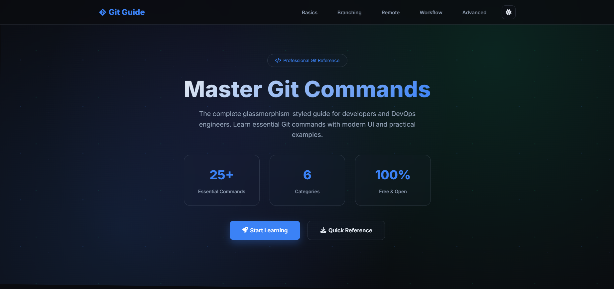
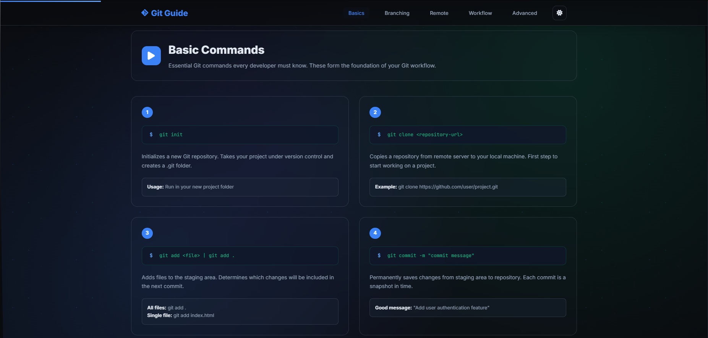
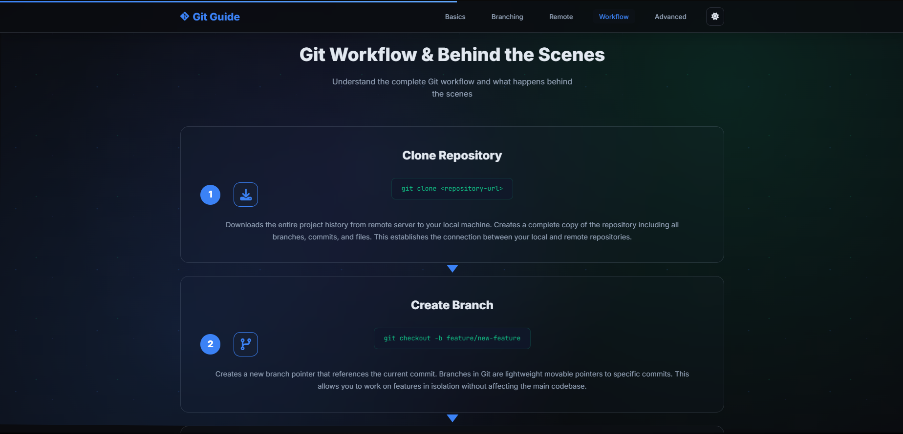

# Git Commands Guide

🚀 **[Live Demo](https://n0tnow.github.io/git-commands-guide/)**

A comprehensive Git commands reference with interactive examples and workflow explanations.



## Features

- Essential Git commands with detailed explanations
- Step-by-step workflow guide
- Interactive copy-to-clipboard functionality
- Dark/Light theme toggle
- Behind-the-scenes Git mechanics explained
- Fully responsive design





## Installation

```bash
git clone https://github.com/n0tnow/git-commands-guide.git
cd git-commands-guide
open index.html
```

Made during internship at i2i Systems by [Bilal Kaya](https://www.linkedin.com/in/Bila1Kaya/)
